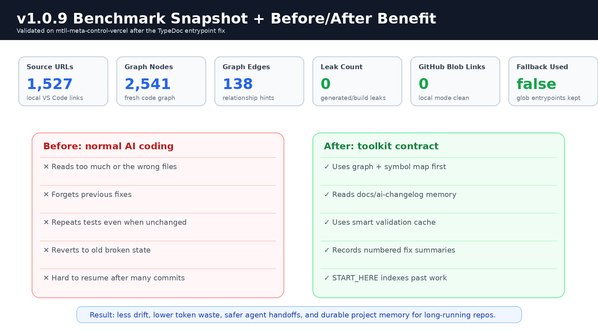
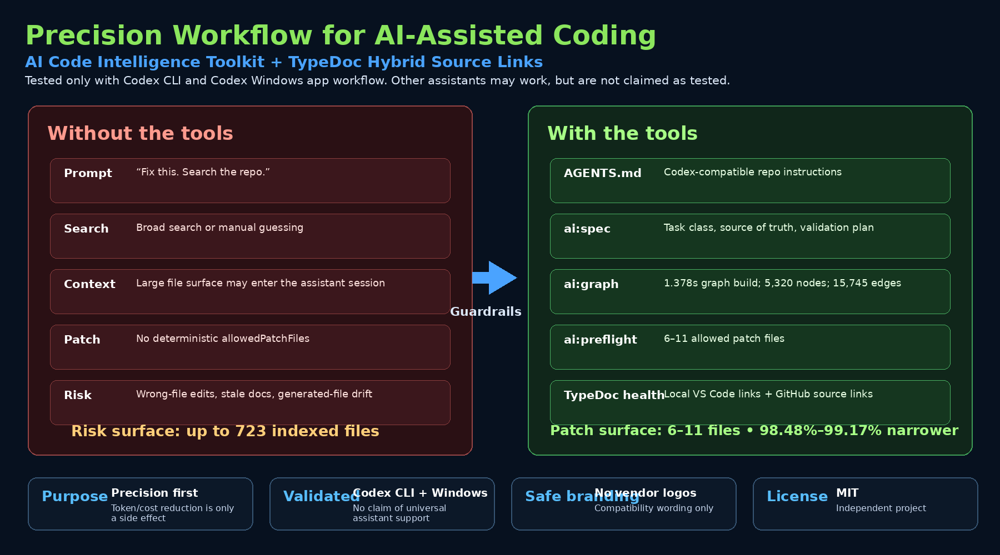

# TypeDoc Hybrid Source Links

[](LICENSE)
[](https://typedoc.org/)
[](#tested-environment)

**TypeDoc Hybrid Source Links** makes TypeDoc documentation useful for both local AI coding workflows and public documentation. It generates local VS Code source links for developer machines and GitHub blob links for browser-based docs.

It is the companion documentation layer for **AI Code Intelligence Toolkit**.

It is **not** a token-saving product. Any token or cost reduction is only a side effect of better source precision and fewer irrelevant files being pulled into an assistant workflow.





---

## Important companion prerequisite

For the complete tested workflow, install **both** tools:

- **TypeDoc Hybrid Source Links**: [https://github.com/xraisen/typedoc-hybrid-source-links](https://github.com/xraisen/typedoc-hybrid-source-links)
- **AI Code Intelligence Toolkit**: [https://github.com/xraisen/ai-code-intelligence-toolkit](https://github.com/xraisen/ai-code-intelligence-toolkit)

**TypeDoc Hybrid Source Links can run by itself** for TypeDoc local/GitHub source-link generation.

**AI Code Intelligence Toolkit can run by itself** for GraphRAG, `ai:spec`, `ai:preflight`, graph doctor, and leak checks.

**They are designed to work best together.** The benchmark, health checks, and guarded Codex-compatible workflow described below are based on using **TypeDoc Hybrid Source Links + AI Code Intelligence Toolkit together**.

Install both:

```bash
npm install --save-dev typedoc-hybrid-source-links ai-code-intelligence-toolkit typedoc
npx typedoc-hybrid-install --target . --overwrite
npx ai-code-intel-install --target . --overwrite
```

Do not skip the companion tool if you want the full workflow:

```txt
TypeDoc Hybrid Source Links = local/GitHub source links, TypeDoc health, AI-readable docs context
AI Code Intelligence Toolkit = graph, preflight, drift control, allowed patch scope
```

---

## What this toolkit does

```txt
typedoc:health       Verifies the TypeDoc hybrid toolchain
typedoc:doctor       Alias for TypeDoc health checks
typedoc:json:local   Generates AI-context TypeDoc JSON with VS Code source links
typedoc:check-local  Confirms local source links are safe and not GitHub placeholders
typedoc:json:github  Generates TypeDoc JSON with GitHub source links
typedoc:html:github  Generates public HTML docs with GitHub source links
typedoc:strict       Runs strict TypeDoc validation when you want TypeScript errors to fail docs
```

---

## Tested environment

This release is tested only on:

```txt
Codex CLI
Codex Windows app workflow
Windows repository worktree
Node.js >= 20
```

Other coding assistants may be able to run the same npm scripts because they are plain Node.js commands, but this project does not claim those workflows are tested.

---

## Why this matters for AI-assisted coding

AI assistants become less reliable when documentation points to the wrong place. Local work needs local source links. Public docs need browser-safe GitHub source links.

This toolkit makes the link mode explicit:

```txt
Local AI worktree:
  vscode://file/<absolute-local-repo-path>/{path}:{line}

Public docs / GitHub Pages:
  https://github.com/<owner>/<repo>/blob/<revision>/{path}#L{line}
```

---

## Install

```bash
npm install --save-dev typedoc-hybrid-source-links typedoc
npx typedoc-hybrid-install --target . --overwrite
```

For the complete validated workflow, install it with **AI Code Intelligence Toolkit**:

```bash
npm install --save-dev typedoc-hybrid-source-links ai-code-intelligence-toolkit typedoc
npx typedoc-hybrid-install --target . --overwrite
npx ai-code-intel-install --target . --overwrite
```

---

## Quick start

```bash
npm run typedoc:health
npm run typedoc:doctor
npm run typedoc:json:local
npm run typedoc:check-local
npm run typedoc:json:github
npm run typedoc:html:github
```

---


## Precision first, savings second

This project is **not made primarily to save tokens or money**.

The main purpose is precision:

- resolve the right files before editing,
- reduce wrong-file drift,
- prevent generated files from becoming source truth,
- give Codex-compatible agents an executable workflow,
- keep TypeDoc links pointed to the correct local or GitHub source.

Lower token and cost exposure can happen as a **side effect** because the agent reads and patches fewer irrelevant files. It is not advertised as a guaranteed billing reduction.

## Benchmark: unstructured AI coding vs guarded Codex-compatible workflow

This benchmark compares two workflows:

| Workflow | Meaning |
|---|---|
| **Without these tools** | A developer or vibe coder asks an AI assistant to inspect, search, or fix a repository without a graph, task preflight, generated-file leak check, or TypeDoc source-link health check. The practical risk surface is the repo surface the assistant may inspect or patch. |
| **With AI Code Intelligence Toolkit + TypeDoc Hybrid Source Links** | A developer runs a Codex-compatible workflow with `AGENTS.md`, `ai:spec`, `ai:preflight`, a local graph, graph doctor, leak checker, and TypeDoc health checks before patching. |

This is a **workflow benchmark**, not a model benchmark. It does not claim to make Codex, Claude, Cursor, Cline, RooCode, Kimi, or any assistant smarter. It measures scope control, graph health, leak detection, and documentation-link health around an assistant.

### Tested environment

The workflow has been tested only with:

```txt
Codex CLI
Codex Windows app workflow
Windows repository worktree
Node.js >= 20
```

Other AI assistants may use the same npm scripts because they are plain Node.js commands, but this README does **not** claim they are tested.

### Real local validation result

| Metric | Without these tools | With these tools | Result |
|---|---:|---:|---:|
| Patch boundary | No deterministic patch boundary | 6 GraphRAG files / 11 TypeDoc files | Fixed |
| Repo surface exposed to the task | Up to 723 indexed files | 6–11 allowed patch files | 98.48%–99.17% narrower patch surface |
| Graph build | Unreliable / timeout-prone baseline | 1.378s, `timedOut: false` | Fast and repeatable |
| Graph doctor | Previously unhealthy | `ok: true` | Pass |
| Generated-file leaks | 1 leak | 0 leaks | 100% leak reduction |
| TypeDoc health | Unconfirmed | `ok: true` | Pass |
| TypeDoc doctor | Unconfirmed | `ok: true` | Pass |
| Workflow smoke gates | No structured health gate | 8/8 passed | 100% workflow pass for tested gates |
| Files processed by graph | — | 723 | Measured |
| Source files indexed | — | 466 | Measured |
| Graph nodes | — | 5,320 | Measured |
| Graph edges | — | 15,745 | Measured |

### File-surface exposure model

The validation run did not record raw token telemetry. Instead, this project reports **file-surface exposure**, which is the safest way to explain why token and cost waste may drop as a side effect.

```txt
GraphRAG task:
  Without the tools: 723-file repo surface
  With the tools: 6 allowed patch files
  Surface reduction: 1 - (6 / 723) = 99.17%
  Unstructured workflow exposes 120.50x more file surface

TypeDoc task:
  Without the tools: 723-file repo surface
  With the tools: 11 allowed patch files
  Surface reduction: 1 - (11 / 723) = 98.48%
  Unstructured workflow exposes 65.73x more file surface

Average of the two tested scopes:
  Average allowed patch files: 8.5
  Average surface reduction: 1 - (8.5 / 723) = 98.82%
  Unstructured workflow exposes 85.06x more file surface
```

### Token and cost honesty

This is **not** sold as a token-saving or money-saving tool.

The primary purpose is precision:

```txt
better file targeting
smaller patch boundaries
less wrong-file drift
health checks before patching
local graph-based repo understanding
TypeDoc links that point to the right source location
```

Lower token or cost exposure can happen as a side effect when an assistant reads fewer irrelevant files. But exact token or billing savings require real telemetry from the assistant session: input tokens, cached input tokens, output tokens, files read, and files patched.

### Drift and workflow accuracy

Measured workflow accuracy in the validation run:

| Gate | Result |
|---|---:|
| `typedoc:health` | Pass |
| `typedoc:doctor` | Pass |
| GraphRAG smart preflight route | Pass |
| TypeDoc smart preflight route | Pass |
| `ai:graph:build` | Pass |
| `ai:graph:doctor` | Pass |
| `ai:graph:check-leaks` | Pass |
| `ai:spec` smoke test | Pass |

```txt
8 / 8 workflow gates passed = 100% workflow pass rate for the tested gates.
Generated-file graph leaks: 1 → 0 = 100% leak reduction.
Patch drift surface: 98.48%–99.17% narrower than the 723-file indexed surface.
```

For true code-correctness accuracy, use a separate labeled benchmark with real tasks, expected files, expected tests, human review, and pass/fail outcomes.


---

## Recommended AGENTS.md instruction

Add this to your repo’s `AGENTS.md`:

```md
## TypeDoc Hybrid Source Links

Use local TypeDoc mode for AI-agent worktrees:

npm run typedoc:json:local
npm run typedoc:check-local

Use GitHub mode for public docs:

npm run typedoc:json:github
npm run typedoc:html:github

Before editing TypeDoc tooling, run:

npm run typedoc:health
npm run typedoc:doctor

Do not use placeholder GitHub links such as your-username/your-repo.
Do not hardcode GitHub blob/main image links when relative paths work.
```

---

## Recommended README section for installed projects

```md
## TypeDoc Hybrid Source Links

This repository uses TypeDoc Hybrid Source Links to generate local VS Code links for AI-agent worktrees and GitHub blob links for public docs.

Common commands:

npm run typedoc:health
npm run typedoc:doctor
npm run typedoc:json:local
npm run typedoc:check-local
npm run typedoc:json:github
npm run typedoc:html:github

Tested workflow: Codex CLI and Codex Windows app workflow.
```

---

## Evidence and sources

This project separates local benchmark evidence from public product documentation.

Local validation evidence:

```txt
typedoc:health → ok: true
typedoc:doctor → ok: true
GraphRAG preflight → graphrag_tooling route + 6 allowed patch files
TypeDoc preflight → typedoc_tooling route + 11 allowed patch files
ai:graph:build → 1.378s, 723 files processed, 466 source files indexed, 5,320 nodes, 15,745 edges
ai:graph:doctor → ok: true
ai:graph:check-leaks → ok: true, leakCount: 0
ai:spec smoke test → ok: true
```

Public documentation:

- OpenAI documents that Codex can be guided by `AGENTS.md` files placed in a repository and that these files can tell Codex how to navigate the codebase, which commands to run, and how to follow project practices.
- OpenAI describes Codex CLI as a cross-platform local software agent.
- OpenAI describes Codex app availability for macOS and Windows.
- OpenAI documents token-based Codex pricing for applicable plans, calculated from input, cached input, and output tokens.
- TypeDoc documents `sourceLinkTemplate` and the `{path}`, `{line}`, and `{gitRevision}` placeholders.

Reference links:

- https://openai.com/index/introducing-codex/
- https://openai.com/index/unrolling-the-codex-agent-loop/
- https://openai.com/index/codex-flexible-pricing-for-teams/
- https://help.openai.com/articles/20001106-codex-rate-card
- https://typedoc.org/documents/Options.Input.html


---

## Copyright and trademark safety

See [TRADEMARKS.md](TRADEMARKS.md). This project is independently maintained and is not owned by or affiliated with OpenAI, Codex, TypeDoc, Microsoft, GitHub, Anthropic, Cursor, Trae, Kimi, Cline, RooCode, or any related vendor.

No vendor logos are shipped.

---


## Companion link

This tool is intended to be paired with **AI Code Intelligence Toolkit**:

[https://github.com/xraisen/ai-code-intelligence-toolkit](https://github.com/xraisen/ai-code-intelligence-toolkit)

## License

MIT.
