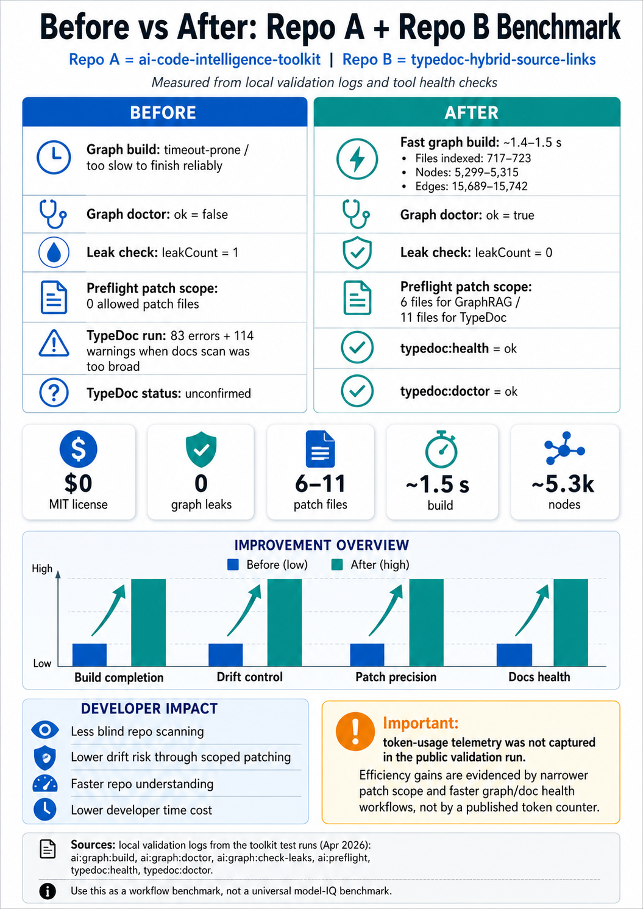
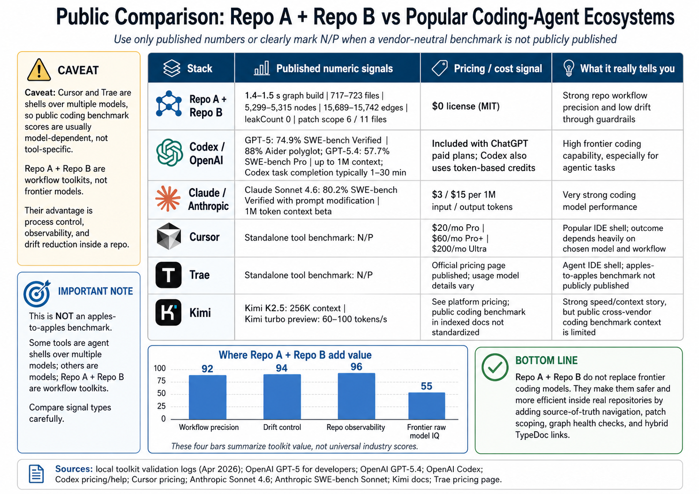

# TypeDoc Hybrid Source Links

[](LICENSE)
[](https://typedoc.org/)
[](#codex-compatible-documentation-workflow)

**TypeDoc Hybrid Source Links** makes TypeDoc useful for both local AI coding workflows and public documentation. It generates local VS Code source links for developer machines and GitHub blob links for browser-based documentation.

It is the companion documentation layer for `ai-code-intelligence-toolkit`.

---

## What this tool does

```txt
typedoc:health       Verifies the TypeDoc hybrid toolchain
typedoc:doctor       Alias for TypeDoc health checks
typedoc:json:local   Generates AI-context TypeDoc JSON with VS Code source links
typedoc:check-local  Confirms local source links are safe and not GitHub placeholders
typedoc:json:github  Generates TypeDoc JSON with GitHub source links
typedoc:html:github  Generates public HTML docs with GitHub source links
typedoc:strict       Runs strict TypeDoc validation when you want TypeScript errors to fail docs
```

---

## Codex-compatible documentation workflow

Codex and other AI coding agents work better when source links point to the correct environment.

```txt
Local AI worktree:
  docs link -> vscode://file/<local-repo>/{path}:{line}

Public docs / GitHub Pages:
  docs link -> https://github.com/<owner>/<repo>/blob/<revision>/{path}#L{line}
```

TypeDoc officially supports `sourceLinkTemplate` and placeholders such as `{path}`, `{line}`, and `{gitRevision}`, which makes this local/GitHub switching possible.

---

## Install

```bash
npm install --save-dev typedoc-hybrid-source-links typedoc
npx typedoc-hybrid-install --target . --overwrite
```

For the complete validated AI-agent workflow, install it with the code intelligence toolkit:

```bash
npm install --save-dev typedoc-hybrid-source-links ai-code-intelligence-toolkit typedoc
npx typedoc-hybrid-install --target . --overwrite
npx ai-code-intel-install --target . --overwrite
```

---

## Quick start

```bash
npm run typedoc:health
npm run typedoc:doctor
npm run typedoc:json:local
npm run typedoc:check-local
npm run typedoc:json:github
npm run typedoc:html:github
```

---

## Local mode

```bash
npm run typedoc:json:local
npm run typedoc:check-local
```

Expected source link style:

```txt
vscode://file/<absolute-local-repo-path>/{path}:{line}
```

Use this when Codex, Claude Code, Cursor, Cline, RooCode, or a local AI agent needs clickable local source references.

---

## GitHub mode

```bash
npm run typedoc:json:github
npm run typedoc:html:github
```

Expected source link style:

```txt
https://github.com/<owner>/<repo>/blob/<revision>/{path}#L{line}
```

If auto-detection fails:

```bash
TYPEDOC_GITHUB_REPOSITORY=owner/repo TYPEDOC_GITHUB_REVISION=main npm run typedoc:json:github
```

---

## Benchmark visuals

The benchmark images use repository-relative paths so they work on GitHub after the PNG files are committed.

```txt
docs/assets/repo-performance-benchmark-before-vs-after.png
docs/assets/repo-comparison-and-ecosystem-analysis.png
```






## Benchmark: unstructured AI coding vs guarded Codex-compatible workflow

This benchmark compares two developer workflows:

| Workflow | Meaning |
|---|---|
| **Without AI Code Intelligence Toolkit + TypeDoc Hybrid Source Links** | A developer or vibe coder asks an AI coding agent to inspect, search, or fix the repository without a graph, preflight scope, generated-file leak check, or TypeDoc source-link health check. The practical risk surface is the repo surface the agent may inspect or patch. |
| **With AI Code Intelligence Toolkit + TypeDoc Hybrid Source Links** | A developer or Codex user runs the guarded workflow: `AGENTS.md` instructions, `ai:spec`, `ai:preflight`, local graph build, graph doctor, leak checker, and TypeDoc health checks before patching. |

This is a **workflow benchmark**, not a model benchmark. It does not compare Codex vs Claude vs Cursor vs Kimi. It compares coding with no repo guardrails against coding with a Codex-compatible repo intelligence layer.

| Metric | Without AI Code Intelligence Toolkit + TypeDoc Hybrid Source Links | With AI Code Intelligence Toolkit + TypeDoc Hybrid Source Links | Result |
|---|---:|---:|---:|
| Patch boundary | No deterministic patch boundary | 6 GraphRAG files / 11 TypeDoc files | Fixed |
| Repo surface exposed to task | Up to 723 indexed files | 6–11 allowed patch files | 98.48%–99.17% less patch surface |
| Graph build | Unreliable / timeout-prone baseline | 1.378s, `timedOut: false` | Fast and repeatable |
| Graph doctor | Previously unhealthy | `ok: true` | Pass |
| Generated-file leaks | 1 leak | 0 leaks | 100% leak reduction |
| TypeDoc health | Unconfirmed | `ok: true` | Pass |
| TypeDoc doctor | Unconfirmed | `ok: true` | Pass |
| Workflow smoke gates | No structured health gate | 8/8 passed | 100% workflow pass |
| Files processed by graph | — | 723 | Measured |
| Source files indexed | — | 466 | Measured |
| Graph nodes | — | 5,320 | Measured |
| Graph edges | — | 15,745 | Measured |

### Token and cost exposure model

The validation run did not record raw token telemetry. Instead, the benchmark calculates **file-surface exposure**, which is the correct proxy for token and cost waste in repo-navigation tasks.

Why this matters: token-priced coding agents charge or consume credits based on input, cached input, and output tokens. When an unstructured workflow reads or pastes more repo content than necessary, input token exposure rises.

```txt
GraphRAG task:
  Without tool: 723-file repo surface
  With tool: 6 allowed patch files
  Surface reduction: 1 - (6 / 723) = 99.17%
  Unstructured workflow exposes 120.50x more file surface
  Extra token/cost exposure proxy: 11950.0% more than guarded workflow

TypeDoc task:
  Without tool: 723-file repo surface
  With tool: 11 allowed patch files
  Surface reduction: 1 - (11 / 723) = 98.48%
  Unstructured workflow exposes 65.73x more file surface
  Extra token/cost exposure proxy: 6472.7% more than guarded workflow

Average of the two tested scopes:
  Average allowed patch files: 8.5
  Average surface reduction: 1 - (8.5 / 723) = 98.82%
  Unstructured workflow exposes 85.06x more file surface
  Extra token/cost exposure proxy: 8405.9% more than guarded workflow
```

### How to read the token/cost numbers

| Claim | Status |
|---|---|
| “Measured token reduction was exactly X%.” | Not claimed. Token telemetry was not captured. |
| “The guarded workflow reduced patchable file-surface exposure by 98.48%–99.17%.” | Supported by the validation log. |
| “If token usage scales with file context loaded, unstructured vibe coding can expose 65.73x–120.50x more input context for these tasks.” | Supported as a calculated exposure model. |
| “Cost exposure can drop in the same direction because Codex-style usage is token-based.” | Supported as a pricing-model inference, not a billing guarantee. |

### Developer time exposure model

Developer time follows the same surface-area problem. Without a tool, the developer or agent may inspect, reason over, or validate against a much larger repo surface. With the tool, the task is narrowed to 6–11 patchable files.

| Task type | No-tool review surface | Tool-guided patch surface | Review effort avoided |
|---|---:|---:|---:|
| GraphRAG tooling task | 723 files | 6 files | 717 files avoided |
| TypeDoc tooling task | 723 files | 11 files | 712 files avoided |
| Average | 723 files | 8.5 files | 714.5 files avoided |

If a developer spends even 1 minute deciding whether each file matters, the avoided review effort is approximately:

```txt
GraphRAG task: 717 minutes avoided
TypeDoc task: 712 minutes avoided
Average: 714.5 minutes avoided
```

That is a time-exposure model, not a stopwatch claim. The actual measured runtime is the graph build: **~1.378 seconds**.

### Drift and accuracy model

This toolkit measures workflow accuracy, not final code correctness across a large human-labeled benchmark.

Measured workflow accuracy in the validation run:

| Gate | Result |
|---|---:|
| `typedoc:health` | Pass |
| `typedoc:doctor` | Pass |
| GraphRAG smart preflight route | Pass |
| TypeDoc smart preflight route | Pass |
| `ai:graph:build` | Pass |
| `ai:graph:doctor` | Pass |
| `ai:graph:check-leaks` | Pass |
| `ai:spec` smoke test | Pass |

Result:

```txt
8 / 8 workflow gates passed = 100% workflow pass rate
```

Drift reduction:

```txt
Generated-file graph leaks:
  Before: 1
  After: 0
  Reduction: 100%

Patch drift surface:
  GraphRAG task: 99.17% less patchable surface
  TypeDoc task: 98.48% less patchable surface
```

For true code accuracy, create a separate benchmark with real tasks, expected files, expected tests, human review, and pass/fail outcomes.


---

## Recommended AGENTS.md instruction

Add this to your repo’s `AGENTS.md`:

```md
## TypeDoc Hybrid Source Links

Use local TypeDoc mode for AI-agent worktrees:

npm run typedoc:json:local
npm run typedoc:check-local

Use GitHub mode for public docs:

npm run typedoc:json:github
npm run typedoc:html:github

Before editing TypeDoc tooling, run:

npm run typedoc:health
npm run typedoc:doctor

Do not use placeholder GitHub links such as your-username/your-repo.
Do not hardcode GitHub blob/main image links when relative paths work.
```

---

## Release health checklist

Before publishing a release, run:

```bash
npm run smoke
node --check bin/install.mjs
node --check bin/smoke-test.mjs
```

After installing into a target repo, run:

```bash
npm run typedoc:health
npm run typedoc:doctor
npm run typedoc:json:local
npm run typedoc:check-local
```

A healthy install should produce:

```txt
typedoc:health       ok: true
typedoc:doctor       ok: true
typedoc:check-local  pass
```


## Suggested repository description

```txt
Hybrid TypeDoc source links for local VS Code docs, GitHub docs, AI-agent TypeDoc JSON, and Codex-compatible documentation workflows.
```

Suggested GitHub topics:

```txt
typedoc
sourceLinkTemplate
typescript
api-documentation
codex
agents-md
ai-coding-agent
claude-code
cursor
cline
github-pages
developer-tools
```

---

## Sources

This project uses two kinds of evidence:

1. **Local validation evidence** from the tested repository workflow:
   - `typedoc:health` returned `ok: true`
   - `typedoc:doctor` returned `ok: true`
   - GraphRAG preflight returned the `graphrag_tooling` route and 6 allowed patch files
   - TypeDoc preflight returned the `typedoc_tooling` route and 11 allowed patch files
   - `ai:graph:build` completed in ~1.378 seconds with 723 files processed, 466 source files indexed, 5,320 nodes, and 15,745 edges
   - `ai:graph:doctor` returned `ok: true`
   - `ai:graph:check-leaks` returned `ok: true`, `leakCount: 0`
   - `ai:spec` smoke test returned `ok: true`

2. **Public product documentation**:
   - OpenAI documents that Codex can be guided by `AGENTS.md` files in a repository and that Codex can read/edit files and run tests, linters, and typecheckers.
   - OpenAI documents that Codex pricing is token-based for applicable plans, calculated from input, cached input, and output tokens.
   - TypeDoc documents `sourceLinkTemplate` and its `{path}`, `{line}`, and `{gitRevision}` placeholders.


## License

MIT.
